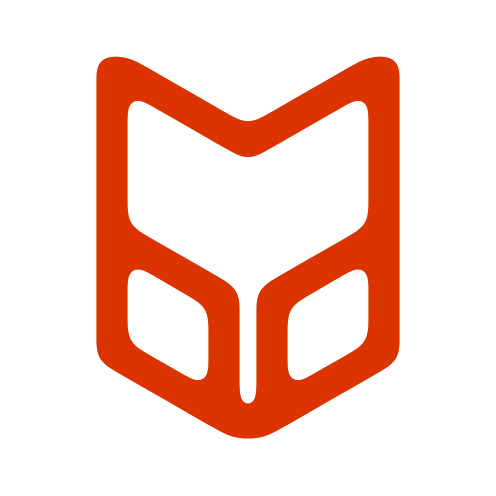

  
  <h1>Kerberos Interactive</h1>
  
<b>Design. Develop. Document.</b>

---

Kerberos Interactive specializes in creating high-quality, focused tools and interactive experiences. We also have fun doing design work (*and fun stuff*). If you've come here and continuing to read this sentence, then we're still hammering away at our foundation here on GitHub (*which acts as an awesome base of operations, by the way*). Pardon our dust.

## 🔭 Our Core Projects

This is where we highlight our public-facing and open-source work.

| Project                                    | Description                                        | Status      |
| ------------------------------------------ | -------------------------------------------------- | ----------- |
| [KIDR](https://github.com/KerberosInteractive/KIDR)      | Kerberos Interactive Data Renamer for Blender.  | ✅ Active   |
| [Kerberos Interactive Website](https://kerberosinteractive.github.io/)| Our official digital presence and portfolio.       | 🚧 In Development |

[link-to-addon]: https://github.com/Kerberos-Interactive/your-product-repo-name
[link-to-web]: https://github.com/Kerberos-Interactive/KI-Website

## 🛠️ Technology & Expertise

We leverage the best tools for the job, with a current focus on the following technologies.

    
  

## 📫 Get in Touch

* **General Inquiries:** `support.kerberosinteractive@proton.me`
* **Security Reports:** Please see our [Security Policy](../SECURITY.md).
